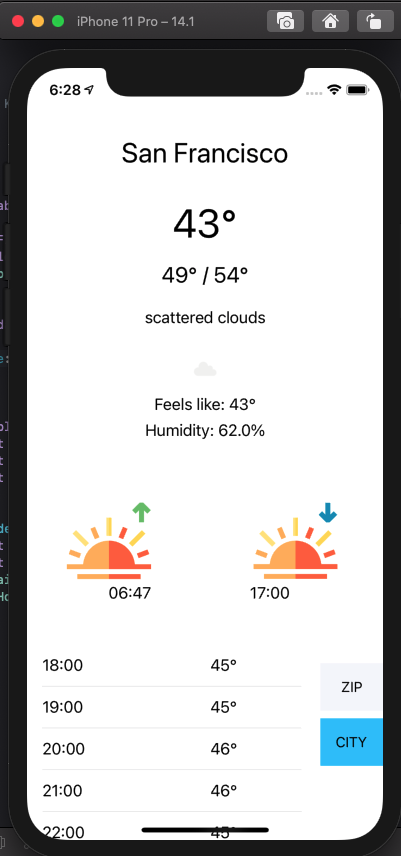
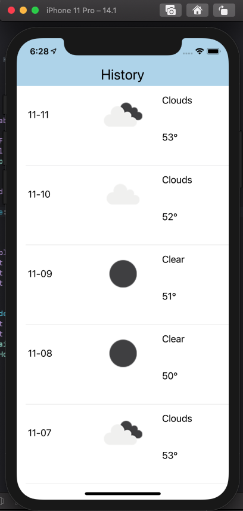
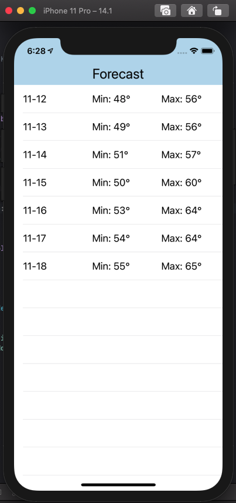

# Darksky
Mini Project 4

This is a basic weather app using the OpenWeatherMap API.

  

  
This is the screen where users can type in their filters. All values outside the lower bound will return 0 and outside the upper bound will return 255.

 
This is a sample screen showing the details of a selected Pokemon. The background color changes accordingly with the type.
