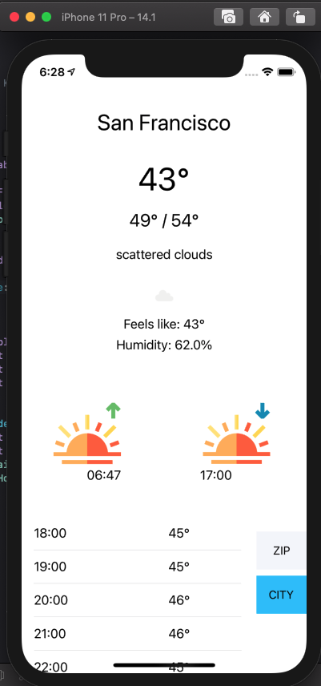
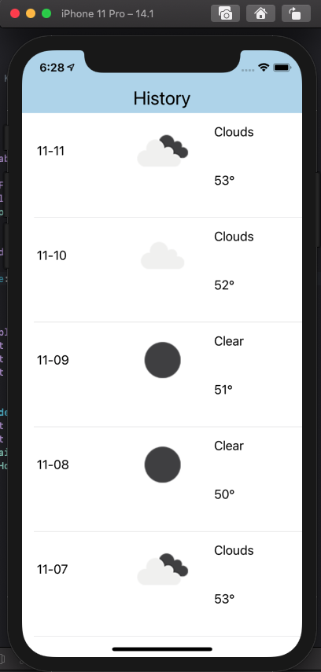
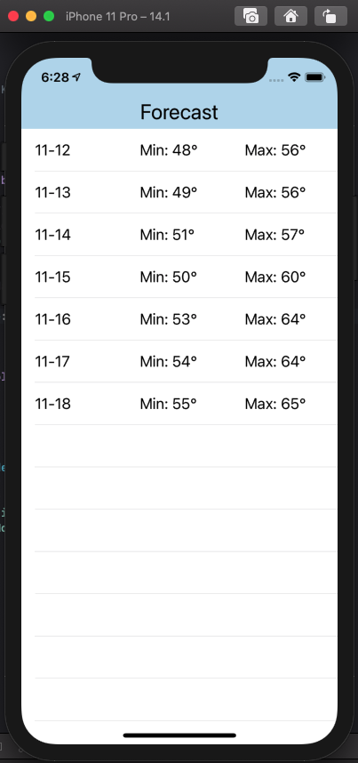

# Darksky
Mini Project 4

This is a basic weather app using the OpenWeatherMap API.

  
This screenshot shows the homescreen of the app, with the current weather anda the hourly forecast for 24 hours.

  
This screenshot shows the weather history for the last five days, the max for the free version of the API

 
This screenshot shows the weather forecast for the next seven days, giving the min and max temperatures
